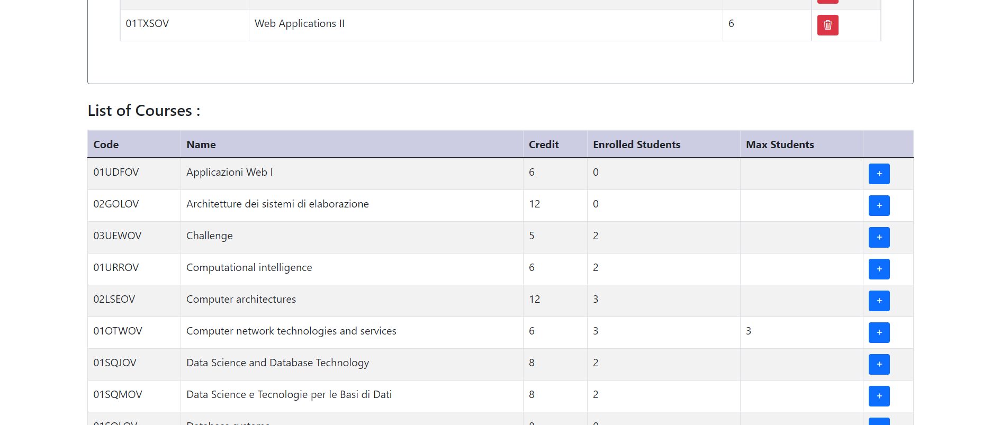

# Exam #1: "StudyPlan"
## Student: s301356 KARANI MARZIYEH 

## React Client Application Routes

- Route `/`: show list of courses to users in a table
- Route `/login`: login page. user can login with username and password
- Route `/studyplan`: loggedin user redirects to this route.in this page list of courses is shown to user. If a submitted study plan already exists,it is loaded, otherwise user can create a studyplan and add courses to it.

## API Server

### User management

#### Login

* POST  `/api/sessions`
* Description: authenticate the user who is trying to login
* Request body: credentials of the user who is trying to login
* {
    "username": "username",
    "password": "password"
}
* Response: `200 OK` (success)
* Response body: authenticated user
* {
    "id": 1,
    "code": "s301356", 
    "name": "Marzi",
    "lastname" : "Karani"
}
* Error responses:  `500 Internal Server Error` (generic error), `401 Unauthorized User` (login failed)

#### Check if user is logged in

* GET `/api/sessions/current`
* Description: check if current user is logged in and get her data
* Request body: none
* Response: `200 OK` (success)
* Response body: authenticated user
* {
    "id": 1,
    "code": "s301356",
    "name": "Marzi",
    "lastname" : "Karani"
}

* Error responses:  `500 Internal Server Error` (generic error), `401 Unauthorized User` (user is not logged in)

#### Logout

* DELETE  `/api/sessions/current`
* Description: logout current user
* Request body: none
* Response: `200 OK` (success)
* Error responses:  `500 Internal Server Error` (generic error), `401 Unauthorized User` (user is not logged in)

### StudyPlan 

#### list of courses

* GET `/api/courses`
* Description: return list of courses
* Request body: none
* Response: `200 OK` (success)
* Response body: list of courses

* [
  {
    "code": "01UDFOV",  
    "name": "Applicazioni Web I",
    "credit" : 6,
    "maxStudents" 0:,
    "preparatoryCourse" : null,
    "incompatibleCourses" :["01TXYOV"],
    "enrolledcount" : 0
}
,
{
    "code": "02GOLOV",  
    "name": "Architetture dei sistemi di elaborazione",
    "credit" : 12,
    "maxStudents" :0 ,
    "preparatoryCourse" : null,
    "incompatibleCourses" :["02LSEOV"],
    "enrolledcount" : 0
}
, ...]
* Error responses:  `500 Internal Server Error` (generic error)

#### add studyplan

* POST  `/api/studyplan`
* Description: add a studyplan for the loggedin user 
* Request body: description of the object to add (id will be automatically generated in db, studentCode will be replaced with code of the loggedin user)
* {
    "id": " ",
    "studentCode": "s301356",
    "type": "FullTime",
    "minCredit" : 60,
    "maxCredit" : 80,
    "totalCredit" : 71,
    "courses" : ["02LSEOV","01TYMOV","01OTWOV",...]}
* Response: `201 OK` (created)
* Error responses:   `503 Service Unavailable` (database error), `401 Unauthorized User` (login failed) ,
`422  Unprocessable Entity` (Validation of request body failed)

#### update studyplan

* PUT  `/api/studyplan/:id`
* Description: Update an existing studyplan 
* Request body: description of the object to update (only totalCredit and courses can be updated)
* {
    "id": 21,
    "studentCode": "s301356",
    "type": "FullTime",
    "minCredit" : 60,
    "maxCredit" : 80,
    "totalCredit" : 71,
    "courses" : ["02LSEOV","01TYMOV","01OTWOV",...]}
* Response: `200 OK` (success)
* Error responses:   `503 Service Unavailable` (database error), `401 Unauthorized User` (login failed),
`422  Unprocessable Entity` (Validation of request body failed)

#### return StudyPlan

- GET `/api/studyplan`
* Description: return studyplan of the loggedin user
* Request body: none
* Response: `200 OK` (success)
* Response body: studyPlan
* {
    "id" : 21,
    "studentId" : 1
    "studentCode": "s301356",
    "type": "FullTime",
    "minCredit" : 60,
    "maxCredit" : 80,
    "totalCredit" : 71,
    "courses" : ["02LSEOV","01TYMOV","01OTWOV",...]}
* Error responses:  `500 Internal Server Error` (generic error), `401 Unauthorized User` (login failed)

#### return StudyPlan Courses

- GET `/api/studyplan/:id/courses`
* Description: return courses of the given study plan
* Request body: none
* Response: `200 OK` (success)
* Response body: an array of studyPlan courses

* [
  {
    "code": "02GOLOV",  
    "name": "Architetture dei sistemi di elaborazione",
    "credit" : 12,
    "maxStudents" :0 ,
    "preparatoryCourse" : null
  },
  {
    "code": "02GOLOV",  
    "name": "Architetture dei sistemi di elaborazione",
    "credit" : 12,
    "maxStudents" :0 ,
    "preparatoryCourse" : null
  },
  ...]

* Error responses:  `500 Internal Server Error` (generic error), `401 Unauthorized User` (login failed),
`422  Unprocessable Entity` (Validation of request body failed)

#### Delete an existing studyplan

* DELETE `/api/studyplan`
* Description: Delete existing studyplan of the loggedin user
* Request body: none.
* Response header:  `204 No Content` (success).
* Response body: none.

* Error responses:  `503 Service Unavailable` (database error), `401 Unauthorized User` (login failed)

## Database Tables

- Table `course` - contains code name credit maxStudents preparatoryCourse
- Table `incompatibleCourses` - contains id course1 course2
- Table `student` - contains id code name lastName email password salt
- Table `studyPlan` - contains id studentId studentCode type minCredit maxCredit totalCredit
- Table `studyPlanCourses` - contains id studyPlanId courseCode

## Main React Components

- `CourseTable` (in `CourseTable.js`): show list of courses
- `CourseRow` (in `CourseTable.js`): show main info for each course
- `DetailsRow` (in `CourseTable.js`): show details for each course
- `IncompatibleRow` (in `CourseTable.js`): show incompatible courses of a course
- `PreparatoryRow` (in `CourseTable.js`): show preparatory course of a course
- `DeleteConfirmation` (in `DeleteConfirmation.js`): show delete confirmation
- `Header` (in `Header.js`): show header navBar
- `Home` (in `HomeView.js`): Define route to Home page for anonymous users
- `LoginForm` (in `LoginForm.js`): Login page
- `StudyPlanForm` (in `StudyPlanForm.js`): study plan form (containing studyplan info form, studyplan table)
- `StudyPlanRoute` (in `StudyPlanView.js`): Define route to Home page for loggedin users(containing studyplan form and course table)
- `LoginRoute` (in `StudyPlanView.js`): Define route to Login page
- `DefaultRoute` (in `StudyPlanView.js`): Define route to notFound page

## Screenshot

## Users Credentials

| username | password | name |
|-------|----------|------|
| s301356 | password | Marzi |
| s301363 | password | John |
| s301357 | password | Roz |
| s321452 | password | Alex |
| s290087 | password | Mario |
| s301358 | password | test |

